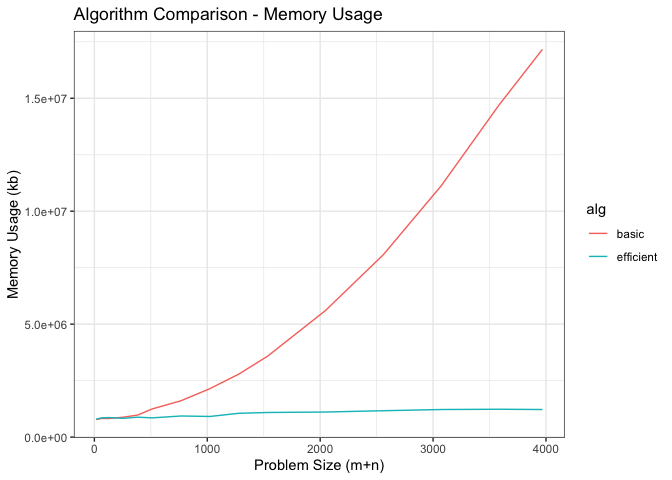
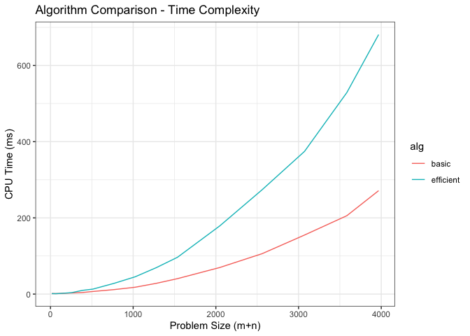

# Overview:

This document compares two sequence alignment implementations. The first, 'basic' alignment, uses the simple dynamic programming solution to creating and optimal alignment. The second, 'efficient' alignment, uses a combination of divide and conquer and dynamic programming to reduce the necessary memory usage from quadratic to linear, while increasing runtime by a factor of two.

# Datapoints:

Before addressing the data, it is important to first acknowledge the
expectations of the resuluts. The “basic alignment” algorithm, utilizing
a purely dynamic programming solution, should have quadratic growth for
both time and memory complexity. The “efficient soltuion”, utilizing a
combination of divide-and-conquer and dynamic programming, should have a
quadratic growth for tiem complexity, but linear growth for memory
complexity. Despite having comparable growth rates, the time complexity
of the efficient soltuion should grow faster than the basic solution by
a factor of 2, which we determined in lecture by diriving the Big-O time
complexities of the basic and efficient solutions to be O(mn) and O(2mn)
respectively. Determining the rate of growth from a data table is not
ideal, especially since the problem size does not increase by a constant
factor. However looking at specific datapoints (i.e. problem sizes 64,
128, 256, 512, and 1024) can allow us to roughly evaluate some of the
changes. The time complexities both appear to follow the exponential
growth with the problem size, but only the memory usage of the basic
algorithm seem to follow this pattern. It is very clear that the memory
usage of the efficient algorithm grows at a rate much slower than the
basic alignment. Also, the CPU time of the efficient algorithm seems to
be roughly 2x that of the basic alignment. This onlys strays slightly at
lower problem sizes where the efficient alignment is actually faster
than the basic alignment (this is consistent with the definition of
asymptotic runtime analysis).

# Discussion: Memory Complexity

Though not clear from the data, the graph of memory usage against
problem size clearly shows the difference in growth rates between the
basic and efficient algorithms. The basic alignment follows strongly
quadratic growth, while the efficient algorithm follows linear growth.
This is because the bulk of the memory usage comes from the dynamic
programming solutions. The basic algorithm must use the full m\*n matrix
to backtrace the proper alignment, and as a result must use at least
m\*n memory. The efficient solution does not, only ever using two
columns of the m\*n matrix at a time, leaving us with linear ( O(m) or
O(n) ) memory usage. However, it is worth noting that the efficient
algorithm appears slightly more variable in memory useage. These
inconsistencies are likely a result of the divide-and-conquer recursive
calls. When we split strings X and Y into two substrings during the
division step of the D&C, we are not guaranteed to get equal size
subproblems. Depending on the input itself, these division may be more
or less efficient at breaking down the problem size, and less efficient
divisions will lead to more recursive calls and therefore a greater
memory overhead. Again, despite being more variable, the memory usage of
the efficient algorithm grows much slower (linear vs. quadratic) than
the basic algorithm.

# Discussion: Time Complexity

Unlike the memory complexity, both the basic and efficient solutions run
in (quadratic) polynomial time, neither algorithm operates in linear
time. The most important note to make is that the growth rate of the
basic algorithm is lower than that of the efficient algorithm. At larger
problem sizes, the basic algorithm is able to run much faster. Looking
at the individual datapoints, we can see that the efficient solution was
more than slightly more than 2x slower than the basic solution at large
problem sizes. This is very close to what we would expect, and I believe
that the reason it appears more than twice as slow is because of the
additional time it takes to generate and run through the recursive
calls. Had I taken the (lots of) extra time to implement a purely
iterative solution for the efficient alignment the growth rate would
more closely match 2x than of the basic solution.

# Contributions

This was an individual project, completed entirely by Alex Hill (Duval
Hill on DEN)
