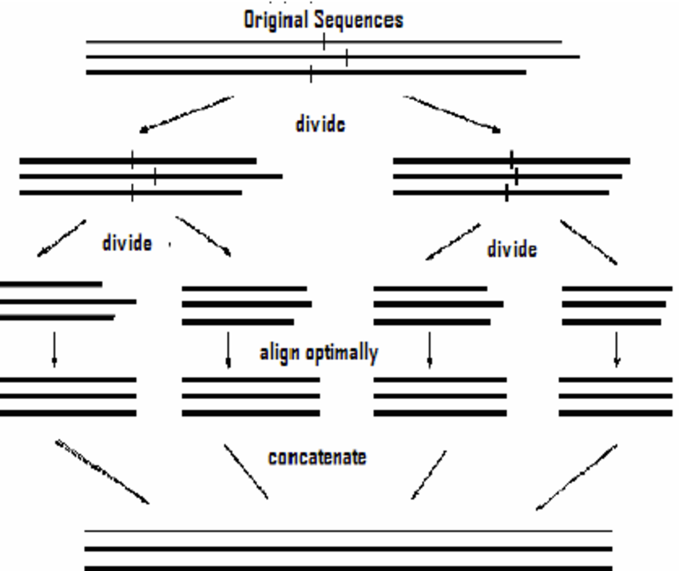

# Overview:

This document compares two sequence alignment implementations. The first, 'basic' alignment, uses the simple dynamic programming solution to creating and optimal alignment. The second, 'efficient' alignment, uses a combination of divide and conquer and dynamic programming to reduce the necessary memory usage from quadratic to linear, while increasing runtime by a factor of two.

# Expectations:

Before addressing the data, it is important to first acknowledge the expectations of the results. The basic alignment algorithm, utilizing a purely dynamic programming solution, should have quadratic growth for both time and memory complexity as a full similarity matrix must be maintined in order to backtrace the alignment.

The efficient soltuion, utilizing a combination of divide-and-conquer and dynamic programming, should have a quadratic growth for time complexity, but linear growth for memory complexity. In this scenario, we don't need to maintain the entire similarity matrix for the pair of sequences as the 'conquer' portion of the divide and conquer will be concatenating aligned fragments together.

Despite having comparable growth rates, the time complexity of the efficient soltuion should grow faster than the basic solution by a factor of 2. More specifically, the basic alignment will run in O(mn) for strings of size m and n, while the efficient solution will run in O(2mn). 

# Discussion: Time Complexity

Both the basic and efficient solutions run in polynomial time (R^2 values of 0.9802 and 0.9795), but the growth rate of the basic algorithm is lower than that of the efficient algorithm. At larger problem sizes, the basic algorithm is able to run much faster, approaching a factor of about x0.4. This improvement is appears to have no correlation to size at larger sizes (p > 0.1), which implies our asymptotic estimates are correct. This is very close to what we would expect, and I believe that the reason the change is not exactly a factor of 0.5 is because of the additional time costs of generating recursive calls. Had I taken the (lots of) extra time to implement a purely iterative solution of the efficient alignment, I would expect the difference growth rates would more closely match the expected factor of x0.5.

# Discussion: Memory Complexity

Comparing memory usage against problem size clearly shows the difference in growth rates between the basic and efficient algorithms. The basic alignment follows strongly quadratic growth (R^2 = 0.9843), while the efficient algorithm follows a much more linear growth (R^2 - 0.9252). The basic algorithm must use a complete m\*n matrix to backtrace the proper alignment, and as a result must use at least m\*n memory. The efficient solution does not need to utilize the entire matrix, only ever using two columns of the m\*n matrix at a time, leaving us with O(2m) or O(2n) memory usage.

However, it is worth noting that the efficient algorithm appears slightly more variable in memory useage and some seem to have polynomial involvement (coef=1.5e-8, p=0.007). These inconsistencies with the expected completely linear memory usage are likely a result of the divide-and-conquer recursive calls. First, recursion has a greater memory overhead than iteration, and as a result the exponential expansion of the recursive calls will utilize more memory than a iterative solution that never needs more than a single iteration's worth of memory at a time. Second, when we split strings X and Y into two substrings during the division step of D&C, we are not guaranteed to get equal size subproblems. Depending on the input itself, these division may be more or less efficient at breaking down the problem size, and less efficient divisions will lead to more recursive calls and therefore a greater memory overhead. Again, despite being more variable, the memory usage of the efficient algorithm grows much slower (linear vs. quadratic) than the basic algorithm.

# Conclusion:

The efficient algorithm for pairwise string alignment is a incredibly useful algorithm. Although there is a cost in worst-case asymptotic runtime, the memory saved by this algorithm is many orders of magnitude greater. When working with sequences that are millions of bases long, we cut the memory usage from gigabytes to megabytes. When working with sequences that are billions of bases long, we cut the memory usage from exabytes (I bet you've never even heard of this before) to gigabytes. The sheer volume of memory can very much be inhibitory to the use of an algorithm, and unique solutions such as this allow for the processing of large scale data to become much more accessible, and in some cases simply feasible.
